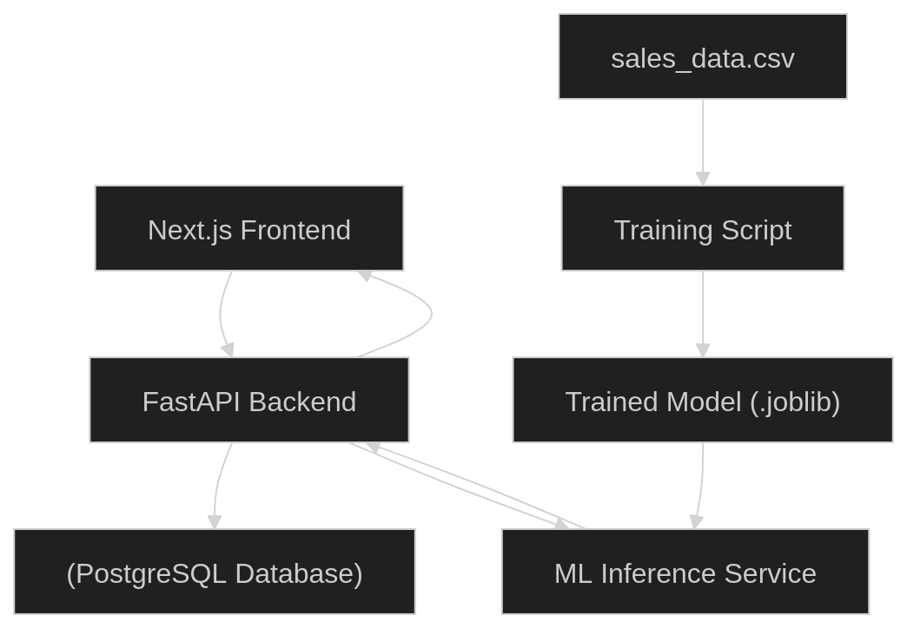

# Project Documentation: Mini AI Sales Prediction

## 1. Project Overview
This project is a full-stack web application designed to manage sales data and predict product sales status (e.g., "Laris" or "Tidak") based on historical sales parameters. It integrates a modern web interface, a robust backend API, and a machine learning pipeline to deliver real-time predictions.

## 2. System Architecture
The application follows a decoupled, three-tier architecture:

*   **Frontend (Presentation Layer):** Built with Next.js and React. It provides an interactive user interface for data visualization and prediction inputs. State management is handled by Zustand.
*   **Backend (Application Layer):** Developed using FastAPI. It exposes RESTful APIs, handles business logic, performs authentication (JWT), interacts with the database, and serves machine learning predictions.
*   **Database (Data Layer):** PostgreSQL is used as the primary relational database, managed via SQLAlchemy ORM and Alembic for migrations.
*   **Machine Learning (Inference Layer):** A separate offline training pipeline evaluates multiple algorithms and exports the best-performing model. The backend loads these artifacts into memory at startup to serve rapid predictions.

### Architecture Diagram

## 3. Data Flow Explanation
The data flow for the core prediction feature operates as follows:

1.  **Request:** The user enters sales parameters (sales volume, price, discount) in the frontend. The Next.js client sends a `POST` request containing a JSON payload and a JWT authorization header to the backend prediction endpoint.
2.  **Authentication & Validation:** FastAPI intercepts the request, validates the JWT payload, and uses Pydantic models to ensure the incoming data types are correct.
3.  **Inference Processing:** 
    *   The backend's `SalesService` receives the validated parameters.
    *   The parameters are transformed using the pre-loaded `scaler.joblib`.
    *   The pre-loaded `best_model.joblib` predicts the numerical class of the product status.
    *   The `label_encoder.joblib` converts the numerical class back into a human-readable string (e.g., "Laris").
4.  **Response:** The backend formats the predicted text into a JSON response and sends it back to the Next.js frontend, which updates the UI.

## 4. API Design
The backend exposes RESTful API endpoints grouped under `/api/v1`. Key endpoints include:

*   `GET /api/v1/`
    *   **Description:** Health check endpoint to verify the API is running.
*   `GET /api/v1/sales/`
    *   **Description:** Retrieves all historical sales data from the database.
    *   **Security:** Requires JWT Token.
*   `POST /api/v1/sales/prediksi`
    *   **Description:** Submits features to the ML model and returns the predicted sales status.
    *   **Security:** Requires JWT Token.
    *   **Payload:** `{ "jumlah_penjualan": int, "harga": int, "diskon": int }`
*   `ANY /api/v1/auth/*`
    *   **Description:** Endpoints dedicated to user authentication and JWT token generation.

## 5. Machine Learning Pipeline
The ML pipeline is localized in the `ml/` directory and is responsible for producing the predictive model.
*   **Data Ingestion:** Loads historical data from `data/sales_data.csv`.
*   **Preprocessing:** Drops missing values, encodes target variables using `LabelEncoder`, splits data (80% train / 20% test) using stratification, and normalizes features using `StandardScaler`.
*   **Training & Evaluation:** Evaluates three algorithms: `LogisticRegression`, `DecisionTreeClassifier`, and `RandomForestClassifier`. It compares them based on Accuracy and F1-Score.
*   **Model Export:** The algorithm with the highest F1-Score is selected. The final model, along with the fitted Scaler and Label Encoder, are serialized using `joblib` and saved to the `ml/model/` directory for backend consumption.

## 6. Tech Stack
*   **Frontend:** Next.js 16, React 19, Tailwind CSS v4, Material UI (MUI), Zustand, Recharts.
*   **Backend:** Python, FastAPI, Uvicorn, SQLAlchemy, Pydantic, python-dotenv.
*   **Database:** PostgreSQL (using psycopg2 driver), Alembic (migrations).
*   **Machine Learning:** scikit-learn, pandas, joblib.
